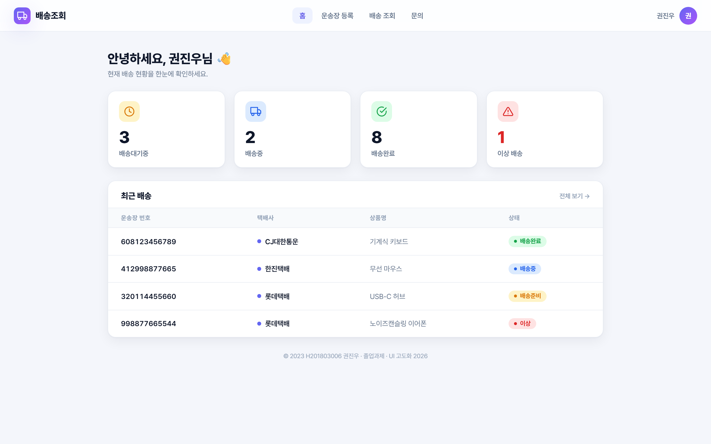
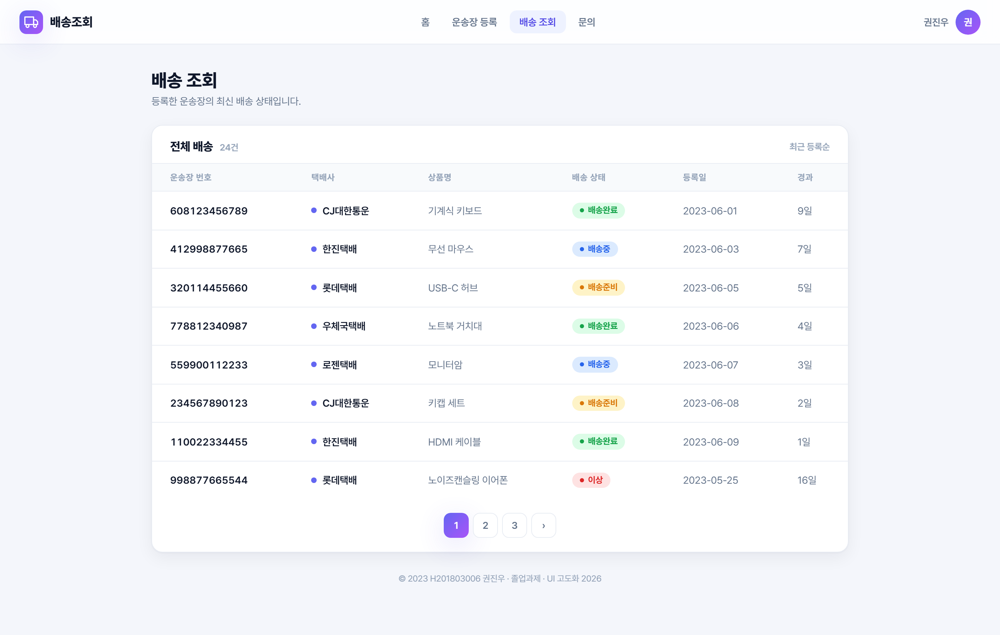
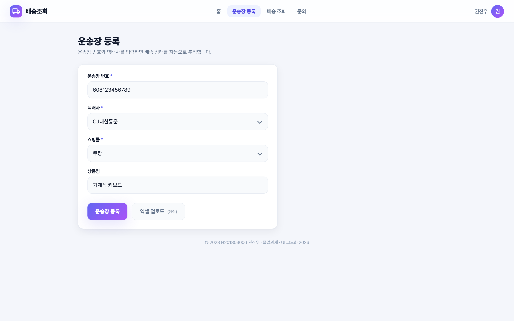
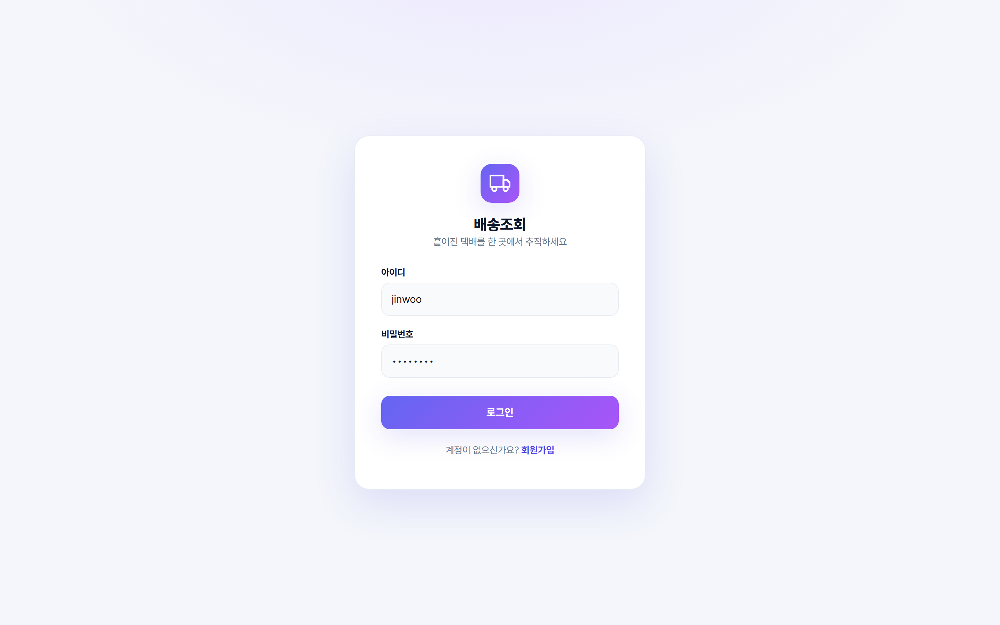
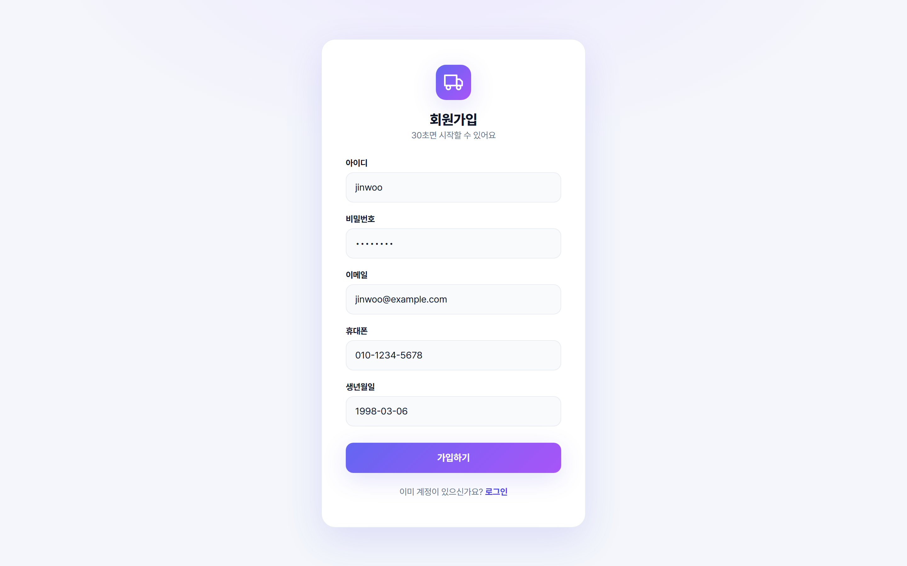
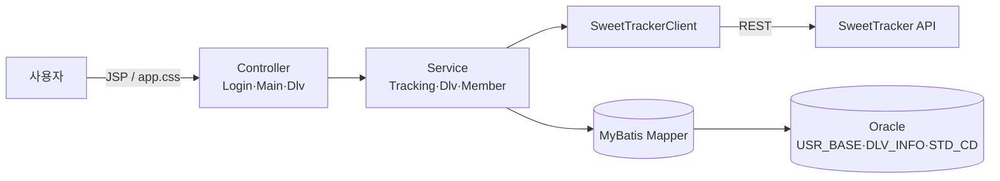

# 배송조회 (Delivery Tracking)

> 여러 쇼핑몰에서 주문한 택배의 운송장을 한 곳에 등록해 두면, **스마트택배(SweetTracker) API**로 배송 상태를 모아 한눈에 보여 주는 웹 애플리케이션.
> 한양사이버대학교 졸업과제 (2023) · H201803006 권진우

---

## 화면

**대시보드** — 배송 현황(대기·배송중·완료·이상)을 통계 카드로, 최근 배송을 상태 배지로



| 배송 조회 | 운송장 등록 |
|---|---|
|  |  |

| 로그인 | 회원가입 |
|---|---|
|  |  |

---

## 기능

- **회원가입 / 로그인** — 세션 기반 인증, 가입 시 ID 중복 체크
- **운송장 등록** — 택배사·쇼핑몰을 공통코드에서 선택하고 운송장 번호·상품명 입력
- **배송 상태 조회** — SweetTracker API로 운송장별 현재 상태를 받아 저장, 상태/택배사를 라벨·배지로 표시
- **대시보드 집계** — 배송대기중 / 배송중 / 배송완료 / **이상건수**(2주 이상 미완료)를 한 화면에
- **일괄 업데이트** — 로그인 시 등록된 운송장을 다시 조회해 최신 상태로 갱신
- **목록 페이징** — 운송장 목록 10건 단위 페이지네이션

---

## 기술 스택

| 영역 | 기술 |
|---|---|
| 언어 | Java 8 |
| 프레임워크 | Spring MVC 5.2 |
| 영속성 | MyBatis 3.5 + HikariCP |
| DB | Oracle XE |
| 뷰 | JSP / JSTL + 자체 디자인 시스템(`app.css`, Pretendard) |
| 패키징 / 서버 | WAR · Tomcat 8.5 |
| 외부 API | 스마트택배(SweetTracker) `trackingInfo` |
| 빌드 | Maven |

---

## 아키텍처



**데이터 모델**

- `USR_BASE` — 회원 (id, pw, email, phone, birth)
- `DLV_INFO` — 배송 레코드. 폴링 시점마다 적재하고 조회 시 `MAX(DLV_STAT)`로 최신 상태를 집계
- `STD_CD` — 공통코드 (`DLV001` = 택배사, `DLV002` = 쇼핑몰)

---

## 실행

```bash
# 1) Oracle XE 에 스키마 + 공통코드 생성
sqlplus 계정/비번 @db/schema.sql
# 2) DB 접속정보 설정
#    hycuProject/src/main/webapp/WEB-INF/spring/root-context.xml
# 3) SweetTracker API 키 설정 (DlvController.TRACKING_API_KEY)
#    발급: https://tracking.sweettracker.co.kr
# 4) 빌드 & 배포
mvn clean package          # → target/controller.war
# controller.war 를 Tomcat 8.5 webapps 에 배포 (Java 8)
```
